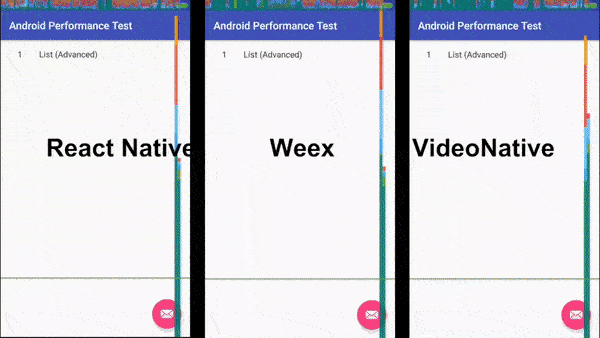

# android-performance

### Git 分支说明
- [master](https://github.com/goodow/android-performance) 使用 Android Studio 模版新建一个 Android 项目, 增加公共代码, 如指标计算和收集/UI 自动化测试等
- [native](https://github.com/goodow/android-performance/tree/native) 基于 master, 使用原生代码实现各种测试场景
- [react-native](https://github.com/goodow/android-performance/tree/react-native) 基于 master, 将 React Native 集成进来, 并使用 React Native 实现各种测试场景
- [weex](https://github.com/goodow/android-performance/tree/weex) 基于 master, 将 Weex 集成进来, 并使用 Weex 实现各种测试场景
    
### 源码目录结构

- [Android代码根目录](https://github.com/goodow/android-performance/tree/master/app/src/main/java/com/goodow/android/performance) 
使用原生代码实现的首页, 用于列出所有的测试场景
  - [cases](https://github.com/goodow/android-performance/tree/master/app/src/main/java/com/goodow/android/performance/cases) 包含各种测试场景
  - [metrics](https://github.com/goodow/android-performance/tree/master/app/src/main/java/com/goodow/android/performance/metrics) 包含各种指标计算方法

- [UI 自动化测试](https://github.com/goodow/android-performance/tree/master/app/src/androidTest/java/com/goodow/android/performance) 使用 UI Automator 实现自动化测试, 包含录屏功能
